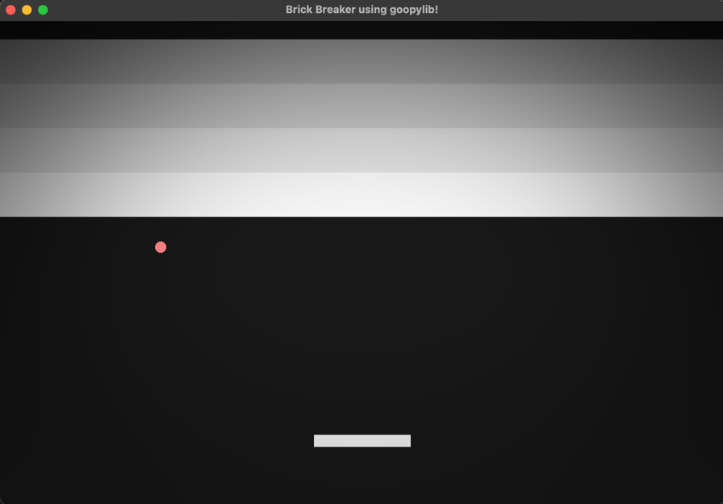

# Brick Breaker in goopylib

A simple recreation of the classic brick breaker game using goopylib.



## How to play using Python?

Clone this repository, install the requirements using pip by running:

```terminal
pip install -r requirements.txt
```

Then open `main.py` and run the code!

## How to play using C++?

Clone this repository and [goopylib](https://github.com/BhavyeMathur/goopylib). You can link against existing binaries given in [goopylib/binaries](https://github.com/BhavyeMathur/goopylib/tree/master/binaries) or follow the [instructions](https://goopylib.readthedocs.io/en/latest/installation.html) to build your own.

Use [CMakeLists.txt](CMakeLists.txt) to build brick breaker and play the game.
